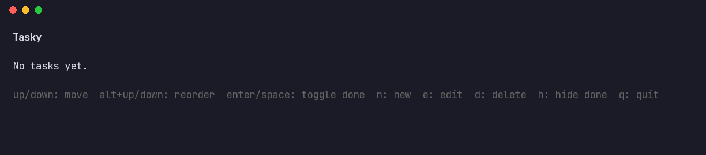

```
████████╗ █████╗ ███████╗██╗  ██╗██╗   ██╗
╚══██╔══╝██╔══██╗██╔════╝██║ ██╔╝╚██╗ ██╔╝
   ██║   ███████║███████╗█████╔╝  ╚████╔╝ 
   ██║   ██╔══██║╚════██║██╔═██╗   ╚██╔╝  
   ██║   ██║  ██║███████║██║  ██╗   ██║   
   ╚═╝   ╚═╝  ╚═╝╚══════╝╚═╝  ╚═╝   ╚═╝
```


**Tasky** is a fast, keyboard-driven todo list that lives in your terminal — written in Go,
backed by a plain JSON file, and (soon) synced straight into your Obsidian notes.

This is my first project ever written in Go.

> **Status:** task persistence and the interactive TUI work; Obsidian sync is not built yet.



## Contents

- [Features](#features)
- [Installing](#installing)
- [Configuration](#configuration)
- [Usage](#usage)
- [Uninstalling](#uninstalling)
- [Building from source](#building-from-source)
- [Roadmap](#roadmap)

## Features

- ⚡ **Instant TUI** — open `tasky` and you're looking at your list, no menus to click through
- ⌨️ **Full keyboard control** — add, edit, reorder, complete, and delete todos without leaving the home row
- 👁️ **Focus mode** — hide completed todos with a single keystroke when you just want to see what's left
- 💾 **Plain JSON storage** — your tasks live in a human-readable file you can back up, sync, or script against
- 🔧 **Configurable** — point Tasky at a custom tasks file and toggle logging from one small config file
- 🔗 **Obsidian sync** — on the roadmap, so your todos and your notes can finally live in the same place

## Installing

To make the `tasky` command available in your terminal:

```
go install ./cmd/tasky
```

This builds the binary and drops it into your Go bin directory — `go env GOBIN` if set,
otherwise `bin` inside `go env GOPATH` (`%USERPROFILE%\go\bin` by default on Windows).
Make sure that directory is on your `PATH`:

```
# PowerShell (add to your $PROFILE to make it permanent)
$env:Path += ";$(go env GOPATH)\bin"
```

```
# bash/zsh (add to your shell rc file to make it permanent)
export PATH="$PATH:$(go env GOPATH)/bin"
```

Once that's done, `tasky` runs from any directory.

## Configuration

Tasky looks for a config file at `~/.tasky/config.json` (`%USERPROFILE%\.tasky\config.json`
on Windows). If it doesn't exist, Tasky creates it on first run with the defaults — tasks
stored at `~/.tasky/tasks.json` and logging off. Edit it to customize either:

```json
{
  "tasksPath": "C:/Users/you/.tasky/tasks.json",
  "logEnabled": true
}
```

- `tasksPath` — where your tasks are saved as JSON. Defaults to `~/.tasky/tasks.json`.
- `logEnabled` — whether Tasky prints log messages while running. Defaults to `false`.

## Usage

Run the built binary (or `go run ./cmd/tasky`) to open the TUI:

| Key            | Action                          |
| -------------- | -------------------------------- |
| `up`/`k`       | Move cursor up                   |
| `down`/`j`     | Move cursor down                 |
| `alt+up`       | Move the selected todo up        |
| `alt+down`     | Move the selected todo down      |
| `enter`/space  | Toggle the selected todo done    |
| `n`            | Create a new todo                |
| `e`            | Edit the selected todo           |
| `d`            | Delete the selected todo         |
| `h`            | Toggle hiding completed todos    |
| `q`            | Quit                             |

## Uninstalling

To remove `tasky` completely — binary, config, and stored tasks:

```
# PowerShell
$bin = if (go env GOBIN) { go env GOBIN } else { "$(go env GOPATH)\bin" }
Remove-Item "$bin\tasky.exe" -Force -ErrorAction SilentlyContinue
Remove-Item -Recurse -Force "$env:USERPROFILE\.tasky"
```

```
# bash/zsh
bindir="$(go env GOBIN)"; [ -z "$bindir" ] && bindir="$(go env GOPATH)/bin"
rm -f "$bindir/tasky"
rm -rf ~/.tasky
```

This deletes the `tasky` binary from your Go bin directory and the `~/.tasky` directory
(`%USERPROFILE%\.tasky` on Windows), which holds your config and tasks. If you added the
Go bin directory to your `PATH` just for `tasky`, remove that line from your shell
profile too.

## Building from source

If you just want a local binary without installing it onto your `PATH`:

```
go build ./cmd/tasky
```

## Roadmap

- [x] Task type with JSON persistence (`SaveAll`/`LoadAll`)
- [x] Interactive TUI (built on [Bubble Tea](https://github.com/charmbracelet/bubbletea))
- [ ] Task groups

---

*Claude Code was used only to generate commit messages, README documentation, and the demo
GIF for this project — all code was written by hand.*
