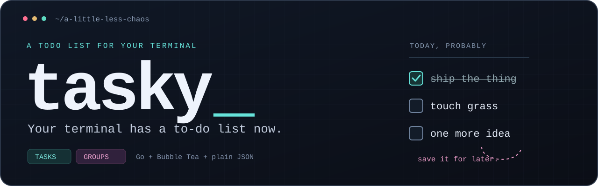
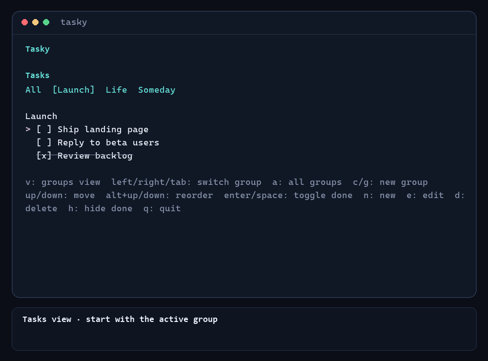

<div align="center">



[](https://go.dev/)
[](https://github.com/charmbracelet/bubbletea)
[](#data-and-configuration)
[](#quick-start)

<br>

<a href="#quick-start">Quick start</a> ·
<a href="#controls">Controls</a> ·
<a href="#data-and-configuration">Data</a> ·
<a href="#roadmap">Roadmap</a>

<br><br>



<sub>Tasks, groups, and keyboard shortcuts — right where your cursor already lives.</sub>

</div>

For the task you remembered halfway through a `git commit`.

Tasky is a terminal todo list written in Go. It opens straight into your list,
keeps tasks in named groups, and saves everything to a human-readable JSON file.
Your side projects, grocery list, and ambitious weekend plans are welcome here.

[Watch or download the MP4](assets/tasky-demo.mp4) ·
[How the demo is made](scripts/demo/README.md)

## Quick start

```bash
git clone https://github.com/LeonExists/tasky.git
cd tasky
go install ./cmd/tasky
tasky
```

Prefer trying it without installing?

```bash
go run ./cmd/tasky
```

Tasky requires Go 1.27 or newer. `go install` places the binary in `GOBIN` when
it is set, otherwise in `GOPATH/bin`. Add that directory to your `PATH` if your
shell cannot find `tasky` after installation.

After pulling source changes, run `go install ./cmd/tasky` again to refresh the
installed binary.

<details>
<summary>Make the installed command available on your PATH</summary>

PowerShell (add the lines to your `$PROFILE` to make them persistent):

```powershell
$goBin = go env GOBIN
if (-not $goBin) { $goBin = Join-Path (go env GOPATH) "bin" }
$env:Path += ";$goBin"
```

bash/zsh (add the export to your shell rc file to make it persistent):

```bash
gobin="$(go env GOBIN)"
if [ -z "$gobin" ]; then gobin="$(go env GOPATH)/bin"; fi
export PATH="$PATH:$gobin"
```

</details>

## Features

- **Two focused views.** Tasks is the checklist; Groups is where you organize,
  rename, reorder, and hide it.
- **Keyboard first.** Add, edit, complete, reorder, and remove without leaving
  the terminal.
- **Hide without deleting.** Disable a group to remove it from the Tasks view
  while keeping every task safely in the JSON file.
- **Plain persistence.** Your data is readable, portable, and easy to back up
  or script against.
- **No ceremony.** Launch `tasky`, see your list, and start moving.

## The two views

### Tasks view

This is the default view. Work inside one enabled group, cycle through groups,
or switch to the all-groups view. Disabled groups never appear in Tasks view
navigation or in the all-groups view.

### Groups view

Press `v` to switch views. Here you can create, rename, reorder, delete, and
enable or disable groups. Disabled groups are hidden by default; press `h` to
show them again. Their tasks stay saved and reappear when you enable the group;
deleting the group deliberately removes them. The view also shows total group
and task counts, open/done counts for each group, and which group is current.

### The someday list can wait

Give a side quest a day off. Hide a whole group and bring it back when you have
room for it:

1. Press `v` to open Groups view and select a group.
2. Press `enter` to disable it; its tasks leave Tasks view immediately.
3. Press `h` to reveal disabled groups, then select the group again.
4. Press `enter` to restore it. The tasks are still there.

## Controls

### Tasks view

| Key | Action |
| --- | --- |
| `left` / `[` / `shift+tab` | Previous enabled group |
| `right` / `]` / `tab` | Next enabled group |
| `a` / `0` | Toggle the all-enabled-groups view |
| `c` / `g` | Create a named group |
| `up` / `k` | Move the task cursor up |
| `down` / `j` | Move the task cursor down |
| `alt+up` | Move the selected task up |
| `alt+down` | Move the selected task down |
| `enter` / `space` | Toggle the selected task done |
| `n` | Create a task in the active group (or the selected task's group in all-groups view) |
| `e` | Edit the selected task |
| `d` | Delete the selected task immediately |
| `h` | Show or hide completed tasks |
| `v` | Switch to Groups view |
| `q` / `ctrl+c` | Quit |

### Groups view

| Key | Action |
| --- | --- |
| `up` / `k` | Move the group selection up |
| `down` / `j` | Move the group selection down |
| `n` / `c` / `g` | Create a named group |
| `e` | Rename the selected group |
| `d` | Start deleting the selected group and its tasks |
| `y` / `enter` | Confirm a pending group deletion |
| `n` / `esc` | Cancel a pending group deletion |
| `alt+up` | Move the selected group up |
| `alt+down` | Move the selected group down |
| `enter` / `space` | Enable or disable the selected group |
| `h` | Show or hide disabled groups (hidden by default) |
| `v` | Switch to Tasks view |
| `q` / `ctrl+c` | Quit |

Deleting a group also deletes all of its tasks, so Tasky asks for confirmation.
Deleting the last group restores an empty enabled `General` group. Task deletion
from Tasks view is immediate.

## Data and configuration

<details>
<summary>Configuration file</summary>

Tasky looks for `~/.tasky/config.json` (`%USERPROFILE%\.tasky\config.json` on
Windows). If it does not exist, Tasky creates it with the default task path and
logging disabled.

```json
{
  "tasksPath": "C:/Users/you/.tasky/tasks.json",
  "logEnabled": true
}
```

- `tasksPath` — where tasks are saved. Defaults to `~/.tasky/tasks.json`.
- `logEnabled` — whether Tasky prints log messages while running. Defaults to
  `false`.

</details>

### Persistence format

Groups and task order are preserved in the JSON file:

```json
{
  "groups": [
    {
      "name": "Personal",
      "tasks": [
        {"text": "Plan the weekend", "done": false}
      ]
    },
    {
      "name": "Archive",
      "disabled": true,
      "tasks": [
        {"text": "Keep this for later", "done": true}
      ]
    }
  ]
}
```

The optional `disabled` property is written only for disabled groups. A missing
property, or `"disabled": false`, means enabled. Grouped files from older
versions therefore load as enabled, and older flat task arrays are automatically
placed in an enabled `General` group so existing todos are not lost.

## Build from source

```bash
go build ./cmd/tasky
```

The resulting binary can be run from the repository, or installed with
`go install ./cmd/tasky` as shown above.

<details>
<summary>Uninstall Tasky</summary>

PowerShell:

```powershell
$goBin = go env GOBIN
if (-not $goBin) { $goBin = Join-Path (go env GOPATH) "bin" }
Remove-Item (Join-Path $goBin "tasky.exe") -Force -ErrorAction SilentlyContinue
Remove-Item "$env:USERPROFILE\.tasky" -Recurse -Force -ErrorAction SilentlyContinue
```

bash/zsh:

```bash
gobin="$(go env GOBIN)"
if [ -z "$gobin" ]; then gobin="$(go env GOPATH)/bin"; fi
rm -f "$gobin/tasky"
rm -rf ~/.tasky
```

This removes the binary, configuration, and saved tasks. If you added the Go
binary directory to your `PATH` only for Tasky, remove that line from your
shell profile too.

</details>

## Roadmap

- [x] Named task groups with JSON persistence
- [x] Interactive TUI built on [Bubble Tea](https://github.com/charmbracelet/bubbletea)
- [x] Separate Tasks and Groups views
- [x] Enable, disable, reorder, rename, and delete groups
- [ ] Obsidian sync, so tasks and notes can live in the same place
- [ ] Configurable task colors and marker-based color rules such as `!` or `!!`

## Contributing

Found a sharp edge or have an idea? Open an issue with the behavior you saw,
or send a focused pull request with a small reproduction when possible.

## Origin

Tasky is my first project ever written in Go. It grew from a simple idea:
keep a fast, keyboard-driven todo list in the terminal.

---

*Claude Code assisted with the original commit messages, README documentation, and
demo GIF. Codex assisted with subsequent feature work and the current demo.*
